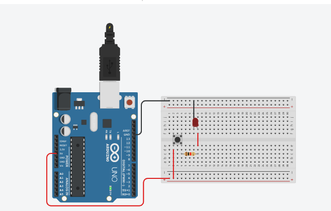

# Usando um botão
 Neste experimento um LED será acesso ao se pressionar um botão. Atenção, nenhuma porta será utilizada. 

 <b><a href="https://www.tinkercad.com/things/6YQNFQRKMeP">Clique Aqui</a></b> para ver o projeto em Tinkercard.com!
 
## Lista de componentes:

- 1  Arduíno UNO R3
- 1  Um cabo de conexão USB
- 1  Placa de prototipação (Protoboard)
- 1  Botão de pressão  
- 1  Resistor de 220 Ω ohms
- 1  LED
- 6  Jumpers (macho-macho)

## Esquema do projeto

